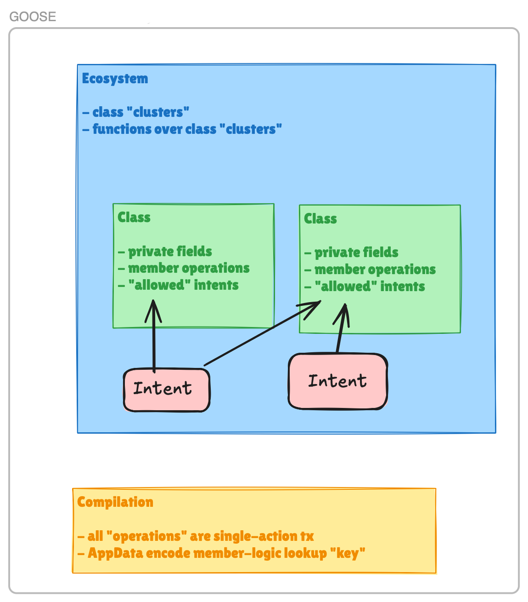

# GOOSE v0.2.1 Summary
A high-level summary description of GOOSE v0.2.1. The description intentionally simplifies some data structures in comparison to the actual Lean implementation. The aim is to provide a high-level overview of the essential features of the model and its translation to the Anoma Resource Machine.

- [GOOSE v0.2.1 Summary](#goose-v021-summary)
	- [Overview](#overview)
	- [AVM data structures](#avm-data-structures)
		- [Intent.Label](#intentlabel)
		- [Class.Label](#classlabel)
		- [Ecosystem.Label](#ecosystemlabel)
		- [Object](#object)
		- [Constructor](#constructor)
		- [Destructor](#destructor)
		- [Method](#method)
		- [Intent](#intent)
		- [Class](#class)
		- [Function](#function)
		- [Ecosystem](#ecosystem)
	- [AVM -\> RM translation](#avm---rm-translation)
		- [Object](#object-1)
			- [Resource data check](#resource-data-check)
		- [Member calls](#member-calls)
			- [Dummy Resource](#dummy-resource)
			- [Action partitioning](#action-partitioning)
			- [Member logics](#member-logics)
			- [App Data](#app-data)
		- [Constructor](#constructor-1)
			- [Constructor call](#constructor-call)
			- [Constructor member logic](#constructor-member-logic)
		- [Destructor](#destructor-1)
			- [Destructor call](#destructor-call)
			- [Destructor member logic](#destructor-member-logic)
		- [Method](#method-1)
			- [Method call](#method-call)
			- [Method member logic](#method-member-logic)
		- [Intent](#intent-1)
			- [Intent creation](#intent-creation)
			- [Intent logic](#intent-logic)
			- [Intent member logic](#intent-member-logic)
		- [Class logic](#class-logic)
		- [Function](#function-1)
			- [Function call](#function-call)
			- [Function member logic](#function-member-logic)
		- [Ecosystem logic](#ecosystem-logic)
	- [Translation issues](#translation-issues)
	- [Implemented example apps](#implemented-example-apps)

## Overview

The Anoma Virtual Machine (AVM) data structures provide an object-oriented abstraction over the Anoma Resource Machine (RM). Ecosystems encapsulate collections of related classes and functions. Each class within an ecosystem uniquely defines its structure through private fields, a set of allowed intents, and member operations — constructors, destructors, and methods. Functions in an ecosystem operate over sets of objects from these classes. Every class belongs to a single ecosystem, and the relationships between classes, their operations, and functions must be fully specified ahead of time — there is no dynamic addition of members or runtime reflection. Intents must be statically declared as allowed for each class of the objects they consume, leading to a rigid dependency graph. An intent is not associated with a single class, but can consume objects of different classes in the same ecosystem.

The translation from AVM to the Resource Machine (RM) relies on the static nature of AVM programs. Each object is compiled to a single resource, tagged with its class and ecosystem metadata. Constructor, destructor, method and function calls, and intent creation, are all translated into single-action transactions. Because all class member operations, functions and intents are known statically, appropriate Resource Logic checks can be generated from their code. A single Resource Logic is generated for a given ecosystem and associated with each object of a class in the ecosystem. The action's App Data contains an indicator for which member's logic should be checked. Logically, the ecosystem logic is a disjunction of the member logics.

## AVM data structures

### Intent.Label
- `Intent.Label` in `AVM/Intent/Label.lean`
- Uniquely identifies an intent.
- Consists of:
	- `Args : Type`. Type of intent arguments. The intent arguments are supplied on intent creation.
	- `name : String`. A unique intent name.

### Class.Label
- `Class.Label` in `AVM/Class/Label.lean`
- Uniquely identifies and specifies a class.
- Consists of:
	- `name : String`. A unique class name.
	- `PrivateFields : Type`. Type of private fields for objects of the class described by the label.
	- `DynamicResourceLabel : PrivateFields -> Type`. Describes dynamic data stored in Resource's `label` field. The dynamic resource label data is determined by the actual values of the object's fields.
	- `ConstructorId : Type`. Enumeration type of identifiers for constructors of the described class.
	- `ConstructorArgs : ConstructorId -> Type`. Type of arguments for a given constructor.
	- `DestructorId : Type`. Enumeration type of identifiers for destructors of the described class.
	- `DestructorArgs : DestructorId -> Type`. Type of arguments for a given destructor.
	- `MethodId : Type`. Enumeration type of identifiers for methods of the described class.
	- `MethodArgs : MethodId -> Type`. Type of arguments for a given method.
	- `intentLabels : Set Intent.Label`. Intents allowed by the described class. An intent can be a member of `intentLabels` in multiple classes.

### Ecosystem.Label
- `Ecosystem.Label` in `AVM/Ecosystem/Label.lean`
- Uniquely identifies and specifies an ecosystem.
- An ecosystem is a collection of classes and functions on objects of these classes. A class belongs to exactly one ecosystem. The functions can have multiple designated `self` arguments (_selves_), all of which are consumed (destroyed or modified) by function invocation.
- Consists of:
	- `classLabels : Set Class.Label`. Classes in the ecosystem. A class can be in only one ecosystem.
	- `FunctionId : Type`. Enumeration type for functions in the described ecosystem.
	- `FunctionArgs : FunctionId -> Type`. Type of function arguments excluding selves.
	- `FunctionSelves : FunctionId -> List Class.Label`. Class identifiers for selves. Every class label of a `self` argument must be in the `classLabels` set.

### Object
- `Object` in `AVM/Object.lean`
- Concrete object representation.
- Consists of:
	- `label : Class.Label` determines the object's class,
	- `quantity : Nat`,
	- private fields,
	- optionally:
		- nonce – ensures the uniqueness of resource commitment and nullifier, available for objects fetched from the Anoma system.

### Constructor
- `Class.Constructor` in `AVM/Class/Member.lean`
- Represents a constructor of an object in a given class.
- Consists of:
	- `label : Class.Label` determines the constructor's class.
	- `id : label.ConstructorId` determines the unique id of the constructor.
	- `Args := label.ConstructorArgs id` is the type of constructor arguments.
	- `created : Args -> Object` . Object created in a constructor call.
	- `invariant : Args -> Bool`. Extra constructor logic. The constructor member logic is a conjunction of auto-generated constructor logic and the extra constructor logic.

### Destructor
- `Class.Destructor` in `AVM/Class/Member.lean`
- Represents a destructor of an object in a given class. Allows to "burn" objects of this class.
- Consists of:
	- `label : Class.Label` determines the destructor's class.
	- `id : label.DestructorId` determines the unique id of the destructor.
	- `Args := label.DestructorArgs id` is the type of destructor arguments excluding `self`.
	- `invariant : (self : Object) -> Args -> Bool`. Extra destructor logic. The destructor member logic is a conjunction of auto-generated destructor logic and the extra destructor logic.

### Method
- `Class.Method` in `AVM/Class/Member.lean`
- Represents a method of an object in a given class.
- Consists of:
	- `label : Class.Label` determines the method's class.
	- `id : label.MethodId` determines the unique id of the method.
	- `Args := label.MethodArgs id` is the type of method arguments excluding `self`.
	- `created : (self : Object) -> Args -> List Object`. Objects created in the method call.
	- `invariant : (self : Object) -> Args -> Bool`. Extra method logic. The method member logic is a conjunction of auto-generated method logic and the extra method logic.

### Intent
- `Intent` in `AVM/Intent.lean`
- Represents an intent – a declarative specification of user's desired outcome.
- Intent creation requires intent arguments and provided objects.
- Consists of:
	- `label : Intent.Label`. The globally unique label of the intent.
	- `condition : label.Args -> (provided : List Object) -> (received : List Object) -> Bool`. The intent condition checks if the desired objects were received. The intent arguments and the provided objects list are supplied at intent creation. The received objects list is supplied by the solver.

### Class
- `Class` in `AVM/Class.lean`
- Represents a class of objects.
- Consists of:
	- `label : Class.Label`. Unique class label.
	- `constructors : Set Class.Constructor`. Set of constructors. There is one constructor for each element of `label.ConstructorId`.
	- `destructors : Set Class.Destructor`. Set of destructors. There is one destructor for each element of `label.DestructorId`.
	- `methods : Set Class.Method`. Set of methods. There is one method for each element of `label.MethodId`.
	- `intents : Set Intent`. Set of intents allowed by the class. There is one intent for each element of `label.intentLabels`.
	- `invariant : (self : Object) -> Logic.Args -> Bool`. Extra class-specific logic. The class logic is the conjunction of the extra class logic and the member logics. `Logic.Args` is the type Resource Logic arguments in the Anoma Resource Machine.

### Function
- `Function` in `AVM/Ecosystem/Function.lean`
- Represents a function in an ecosystem. A function operates on multiple `self` arguments – objects of classes in the ecosystem. The `self` arguments are consumed by the function. There may be other arguments provided beside the `self` arguments.
- Consists of:
	- `label : Ecosystem.Label` determines the function's ecosystem.
	- `id : label.FunctionId` determines the unique id of the funtion.
	- `Args := label.FunctionArgs id` is the type of function arguments excluding selves.
	- `body : (selves : List Object) -> Args -> FunctionResult`. The body of the function. `FunctionResult` is a record which consists of:
		- `assembled : List Object`. List of assembled objects which are created as a result of the function call. It is the responsibility of the user to ensure that assembled object resources balance with the `self` arguments that are not destructed.
		- `destroyed : List Object`. List of destroyed objects. Destroyed object resources are balanced with automatically generated created ephemeral resources.
		- `constructed : List Object`. List of constructed objects. Constructed object resources are balanced with automatically generated consumed ephemeral resources.
		- `destructed : List Object`. List of destructed selves. This must be a sublist of `selves`.
	- `invariant : (selves : List Object) -> Args -> Bool`. Extra function logic. The function member logic is a conjunction of the auto-generated function logic and the extra function logic.
- `selves : List Object` in `body` and `invariant` above is a list of `self` arguments - objects whose classes are described by `label.FunctionSelves id`.

### Ecosystem
- `Ecosystem` in `AVM/Ecosystem.lean`
- Represents an ecosystem of mutually dependent classes and functions.
- Consists of:
	- `label : Ecosystem.Label`. Unique ecosystem label.
	- `classes : Set Class`. Classes in the ecosystem. A class is in exactly one ecosystem.
	- `functions : Set Function`. Functions in the ecosystem. A function is in exactly one ecosystem.

## AVM -> RM translation

### Object

Objects are translated to Resources. Currently, it's a 1:1 translation.

- `label` (the class label) is stored in the `label` field.
- `quantity` is stored in the `quantity` field.
- Private fields are stored in the `value` field.
- The Resource Logic (RL) of the resource corresponding to the object is determined by the ecosystem of the object's class. This way the resource kind (label + logic) determines the object class.
- The ephemerality of the resource is _not_ determined by the object. An object can map to either an ephemeral or a persistent resource depending on how it is used in the action.
- If `nonce` is not `none`, then it is stored in the `nonce` field. Otherwise, the nonce is computed as follows.
	 - For consumed persistent resources the nonce must be available in the object.
	 - For consumed ephemeral resources the nonce is random.
	 - For created resources (persistent and ephemeral) the nonce is equal to the nullifier of the consumed resource in the same compliance unit.
- The `nullifierKeyCommitment` field is computed using the universal nullifier key.

#### Resource data check
Resource data check `checkDataEq(res,obj)` compares a resource `res` against an object `obj`.

- `Class.Member.Logic.checkResourceData` in `AVM/Class/Member/Logic.lean`.
- Check `res.label == obj.label`.
- Check `res.logicHash` is equal to the hash of the [ecosystem logic](#ecosystem-logic) for the ecosystem of the class of `obj`.
- Check `res.quantity == obj.quantity`.
- Check `res.value` encodes the private fields of `obj`.

### Member calls

Calls to class members (constructor, destructor or method calls), function calls and intent creation are translated into single-action transactions. The generated Action contains a list of Compliance Units and a map from Resources to their App Data.

A Compliance Unit has exactly one consumed and one created resource. To ensure matching numbers of consumed and created resources, dummy ephemeral resources with quantity 0 are put in as placeholders in compliance units.

#### Dummy Resource
Dummy Resource has the unique dummy label and the always-true resource logic.

- `dummyResource` in `AVM/Action/DummyResource.lean`.
- Ephemeral with quantity 0.
- Used as a placeholder in compliance units to ensure that the numbers of consumed and created resource match.
- The nonce is set on creation according to the general rules for assigning nonces to ephemeral resources:
	- consumed dummy resources – random,
	- created dummy resources – nullifier of the consumed resource in the same compliance unit.
- Resource Logic of the Dummy Resource is always true.
- Dummy Resource uses the universal key commitment.

#### Action partitioning
An Action can be considered to contain lists of consumed and created non-dummy resources. We partition Actions into Compliance Units as follows.

- We put every non-dummy consumed resource in a separate compliance unit with a created Dummy Resource.
- We put every non-dummy created resource in a separate compliance unit with a consumed Dummy Resource.
- See: `AVM/Action.lean`.
In what follows, when referring to consumed and created resources of an Action, we implicitly ignore Dummy Resources.

#### Member logics
A member logic is a logic for a specific member call:

- constructor,
- destructor,
- method,
- function,
- intent creation,
- always false logic.

The member logics check the constraints for the member call. App Data contains an indicator which member logic should be checked.

The intent member logic is distinct from the intent logic. The intent member logic is checked for each object consumed on intent creation, asserting that the created intent is allowed for the object's class. The intent logic is checked on intent resource consumption, asserting that the intent condition holds.

#### App Data
App Data for each (non-dummy) resource in the action consists of:

- member logic indicator:
	- for consumed resources: member logic for the member being called,
	- for created resources: always false logic[^1],
- member call arguments `args` (except for the intent member logic).

### Constructor

#### Constructor call
Constructor calls are translated to single-action transactions. The action for a call to a constructor `constr` with arguments `args : constr.Args` is specified by the following.

- `Class.Constructor.action` in `AVM/Class/Translation.lean`.
- Consumed resources:
	- one ephemeral resource corresponding to the created object `constr.created args`.
- Created resources:
	- one persistent resource corresponding to the created object `constr.created args`.

#### Constructor member logic
Constructor member logic is the member logic executed for the consumed ephemeral resource in the transaction for a constructor call. Constructor logic is implemented in `Class.Constructor.logic` in `AVM/Class/Translation.lean`.

Constructor member logic has access to RL arguments which contain the following.

- `consumed : List Resource`. List of resources consumed in the transaction.
- `created : List Resource`. List of resources created in the transaction.
- App Data for the consumed ephemeral resource, which contains the constructor call arguments `args`.

Constructor member logic for a constructor `constr` performs the following checks.

- `consumed` contains exactly one ephemeral resource `res` and `checkDataEq(res, constr.created args)` holds.
- `created` contains exactly one persistent resource `res'` and `checkDataEq(res', constr.created args)` holds.
- `constr.invariant args` holds.

### Destructor

#### Destructor call
Destructor calls are translated to single-action transactions. The action for a call to a destructor `destr` on `self : Object` with arguments `args : destr.Args` is specified by the following.

- `Class.Destructor.action` in `AVM/Class/Translation.lean`.
- Consumed resources:
	- one persistent resource corresponding to `self`.
- Created resources:
	- one ephemeral resource corresponding to `self`.

#### Destructor member logic
Destructor member logic is the member logic executed for the consumed persistent resource in the transaction for a destructor call. The consumed resource `selfRes` corresponds to the `self` object in the destructor call. Destructor logic is implemented in `Class.Destructor.logic` in `AVM/Class/Translation.lean`.

Destructor member logic has access to RL arguments which contain the following.

- `selfRes` consumed resource.
- `consumed : List Resource`. List of resources consumed in the transaction.
- `created : List Resource`. List of resources created in the transaction.
- App Data for the consumed persistent resource `selfRes`, which contains the destructor call arguments `args`.

The `self` object is re-created from `selfRes`.

Destructor member logic for a destructor `destr` performs the following checks.

- `consumed` contains exactly one persistent resource `selfRes` and `checkDataEq(selfRes, self)` holds.
- `created` contains exactly one emphemeral resource `selfRes'` and `checkDataEq(selfRes', self)` holds.
- `destr.invariant self args` holds.

### Method

#### Method call
Method calls are translated to single-action transactions. The action for a call to a method `method` on `self : Object` with arguments `args : method.Args` is specified by the following.

- `Class.Method.action` in `AVM/Class/Translation.lean`
- Consumed resources:
	- one persistent resource corresponding to `self`.
- Created resources:
	- persistent resources corresponding to the created objects `method.created self args`.

#### Method member logic
Method member logic is the member logic executed for the consumed persistent resource in the transaction for a method call. The consumed resource `selfRes` corresponds to the `self` object in the method call. Method logic is implemented in `Class.Method.logic` in `AVM/Class/Translation.lean`.

Method member logic has access to RL arguments which contain the following.

- `selfRes` consumed resource.
- `consumed : List Resource`. List of resources consumed in the transaction.
- `created : List Resource`. List of resources created in the transaction.
- App Data for the consumed resource `selfRes`, which contains the method call arguments `args`.

The `self` object is re-created from `selfRes`.

Method member logic for a method `method` performs the following checks.

- `consumed` contains exactly one persistent resource `selfRes` and `checkDataEq(selfRes, self)` holds.
- `created` contains resources corresponding to the created objects:
	- `created.length == method.created self args`,
	- `checkDataEq(res, obj)` holds pairwise for `(res, obj)` in `zip created (method.created self args)`,
	- each resource in `created` is persistent.
- `method.invariant self args` holds.

### Intent
Intents are translated to intent resources.

- The intent label, the intent arguments and the provided objects are all stored in the resource label.
- The intent resource is ephemeral with quantity 1.
- The nonce is set on intent resource creation to the nullifier of the dummy resource consumed in the same compliance unit.
- The intent resource uses the universal key commitment.

#### Intent creation
Intent creation is translated to a single-action transaction. The action for the creation of an intent `intent` with arguments `args : intent.label.Args` and provided objects `provided` is specified by the following.

- `Intent.action` in `AVM/Intent.lean`.
- Consumed resources:
	- persistent resources corresponding to the provided objects `provided`.
- Created resource:
	- one ephemeral resource corresponding to the created intent.

#### Intent logic
Intent logic is the RL associated with the intent resource. Intent logic is distinct from the intent member logic associated with objects provided to the intent. Intent logic is implemented in `Intent.logic` in `AVM/Intent.lean`.

Intent logic has access to RL arguments which contain the following.

- `intentRes` consumed intent resource.
- `consumed : List Resource`. List of resources consumed in the transaction.
- `created : List Resource`. List of resources created in the transaction.
- `isConsumed : Bool` indicates whether `intentRes` is consumed or created in the transaction.

The intent arguments `args` and provided objects `provided` are retrieved from the label of `intentRes`.

Intent logic for an intent `intent` performs the following checks.

- If `intentRes` is consumed, then re-create received objects `received` from `created` and check `intent.condition args provided received`.
- If `intentRes` is created, then check:
	- `consumed.length == provided.length`,
	- `checkDataEq(res, obj)` holds pairwise for `(res, obj)` in `zip consumed provided`.

#### Intent member logic
Intent member logic is checked for each object consumed (provided) on intent creation. It checks that the intent is allowed for the object's class. The intent member logic is implemented in `Class.Intent.Logic` in `AVM/Class/Translation.lean`.

Intent member logic has access to RL arguments which contain the following.

- `consumed : List Resource`. List of resources consumed in the transaction.
- `created : List Resource`. List of resources created in the transaction.

Intent member logic for an intent `intent` performs the following checks.

- `created` contains exactly one resource `intentRes` with:
	- `intentRes.label.intentLabel == intent.label`.
	- `intentRes.logicHash` equal to the hash of the intent logic for `intent`.
	- `intentRes.ephemeral == true`.
	- `intentRes.quantity == 1`.
- `checkDataEq(res, obj)` holds pairwise for `(res, obj)` in `zip consumed provided`.

### Class logic

Class logic is the logic associated with a class. Class logic is implemented in `Class.logic` in `AVM/Class/Translation.lean`.

Class logic has access to RL arguments `logicArgs : Logic.Args` which contain the following.

- `selfRes` consumed resource.
- App Data for the consumed resource `selfRes`, which contains the member logic indicator.

The `self` object is re-created from `selfRes`.

Class logic for a class `cls` performs the following checks.

- Execute the member logic (constructor, destructor, method or intent member logic) based on the member logic indicator stored in App Data.
- Check `cls.invariant self logicArgs` holds.

### Function

#### Function call
Function call is translated to a single-action transaction. The action for a call to a function `fun` on `selves : List Object` with arguments `args : fun.Args` is specified by the following.

- `Function.action` in `AVM/Ecosystem/Translation.lean`
- Consumed resources:
	- persistent resources corresponding to `selves`,
	- persistent resources corresponding to the destroyed objects `(fun.body selves args).destroyed`,
	- ephemeral resources corresponding to the constructed objects `(fun.body selves args).constructed`.
- Created resources:
	- persistent resources corresponding to the assembled objects `(fun.body selves args).assembled`,
	- ephemeral resources corresponding to the destroyed objects `(fun.body selves args).destroyed`,
	- persistent resources corresponding to the constructed objects `(fun.body selves args).constructed`,
	- ephemeral resources corresponding to the destructed selves `(fun.body selves args).destructed`.

#### Function member logic
Function member logic is the member logic associated with a function. Function member logic is implemented in `Function.logic` in `AVM/Ecosystem/Translation.lean`.

Function member logic has access to RL arguments which contain the following.

- `consumed : List Resource`. List of resources consumed in the transaction.
- `created : List Resource`. List of resources created in the transaction.
- App Data containing the method call arguments `args` and the numbers of:
  - selves,
  - constructed objects,
  - destroyed objects,
  - destructed selves.

For a given function `fun`, we use the numbers stored in App Data to partition `consumed` into:

- `assembledSelves` list of persistent resources corresponding to reassembled selves,
- `destructedSelves` list of persistent resources corresponding to destructed selves,
- `constructedEph` list of ephemeral resources corresponding to constructed objects,
- `destroyed` list of persistent resources corresponding to destroyed obects.

We re-create the `selves` objects from `assembledSelves` and `destructedSelves`.

Similarly, the `created` list is partitioned into:

- `assembled` list of persistent resources corresponding to the selves reassembled in the function body,
- `destructedEph` list of ephemeral resources corresponding to the selves destructed by the function,
- `constructed` list of persistent resources corresponding to the objects constructed in the function body,
- `destroyedEph` list of ephemeral resources corresponding to the objects destroyed in the function body.

Function member logic for a function `fun` performs the following checks.

- `checkDataEq(res, obj)` holds pairwise for `(res, obj)` in `zip assembled (fun.body selves args).assembled`.
- `checkDataEq(res, obj)` holds pairwise for `(res, obj)` in `zip destructedEph (fun.body selves args).destructed`.
- `checkDataEq(res, obj)` holds pairwise for `(res, obj)` in `zip constructed (fun.body selves args).constructed`.
- `checkDataEq(res, obj)` holds pairwise for `(res, obj)` in `zip constructedEph (fun.body selves args).constructed`.
- `checkDataEq(res, obj)` holds pairwise for `(res, obj)` in `zip destroyed (fun.body selves args).destroyed`.
- `checkDataEq(res, obj)` holds pairwise for `(res, obj)` in `zip destroyedEph (fun.body selves args).destroyed`.
- resources in `assembledSelves` are persistent.
- resources in `destructedSelves` are persistent.
- resources in `constructedEph` are ephemeral.
- resources in `destroyed` are persistent.
- resources in `assembled` are persistent.
- resources in `destructedEph` are ephemeral.
- resources in `constructed` are persistent.
- resources in `destroyedEph` are ephemeral.
- `fun.invariant selves args` holds.

### Ecosystem logic

Ecosystem logic is the RL associated with an ecosystem. The RL of a resource corresponding to an object is always the ecosystem logic of the ecosystem of the object's class.

Ecosystem logic has access to RL arguments `logicArgs : Logic.Args` which contain the following.

- App Data containing the member logic indicator.
- `isConsumed : Bool` indicates whether the resource associated with the RL is consumed or created in the transaction.

Ecosystem logic for an ecosystem `eco` performs the following checks.

- If `isConsumed == true`, then:
	- If the member logic indiator is a class member logic indicator (constructor, destructor, method or intent member logic), then execute the class logic for the class associated with this member logic.
	- If the member logic indicator is a function member logic indicator, then execute the corresponding function member logic.
	- If the member logic indicator designates the always false logic, then return `false`.
- If `isConsumed == false`, then return `true`.

## Translation issues

- Handling of nullifier key commitments:
	- needs conceptual work on how to represent them as identities/ownership on a higher level.
- RL checks for the created case:
	- none for now, which is correct for the simple app examples we have, but not general enough,
	- Yulia needs to think about this.
- Member logic indicators:
	- fine to put in App Data, assuming user not malicious,
	- Yulia needs to think more about the security implications.
- Intents are static:
	- every object provided to an intent must have this intent declared in its class,
	- static (compilation time) dependency of classes on allowed intents,
	- severe usability limitation.
- No nested method calls.
	- A method cannot call other methods inside its body. Currently, all method calls need to happen at the top level.

## Implemented example apps

- Counter: `Apps/UniversalCounter.lean`.
	- A universal counter which can be created with zero count and incremented by anyone.
	- Demonstrates the use of ecosystem functions:
		- mutual increment,
		- absorption of a counter into another counter.
- Owned counter: `Apps/OwnerCounter.lean`.
	- Counter with ownership.
	- Constructor: create with count zero.
	- Destructor: destroy when count $\ge 10$.
	- Methods: increment, transfer ownership.
- Kudos: `Apps/Kudos.lean`.
	- Kudos with ownership.
	- Kudos token has: quantity, originator, owner.
	- Operations: mint, burn, transfer, split, merge.
- Kudos bank: `Apps/KudosBank.lean`.
	- Kudos app implemented with a single object KudosBank which tracks all kudo balances.
	- Operations: open, close, mint, burn, transfer.
	- Functions:
    	- cheques: issue, deposit.
    	- auctions: new, bid, end.
- Fixed Kudos:
    - Kudos with 1-to-1 exchange.
    - Kudos token has: quantity, originator, owner.
    - Operations: mint.
    - Intents: swap (1-to-1 exchange).

[^1]: Member logics are checked only when a resource is consumed, so the always false logic will never be run. It needs to return false to prevent it from being maliciously misused to circumvent a member logic check.
